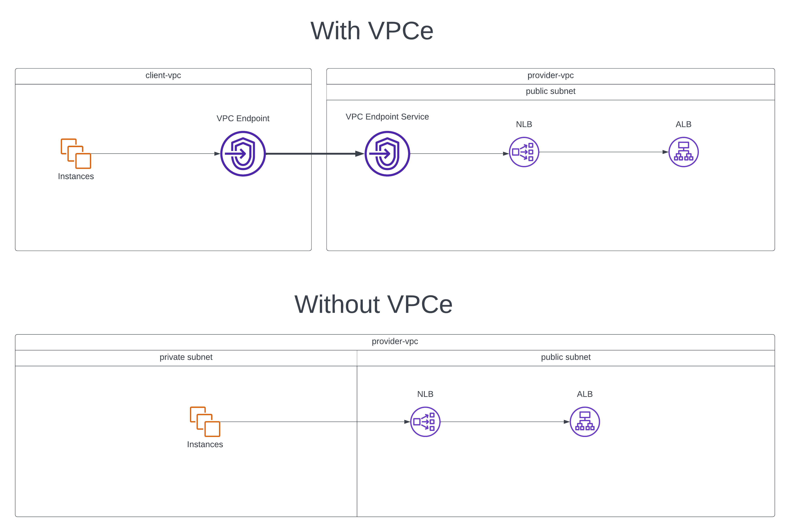
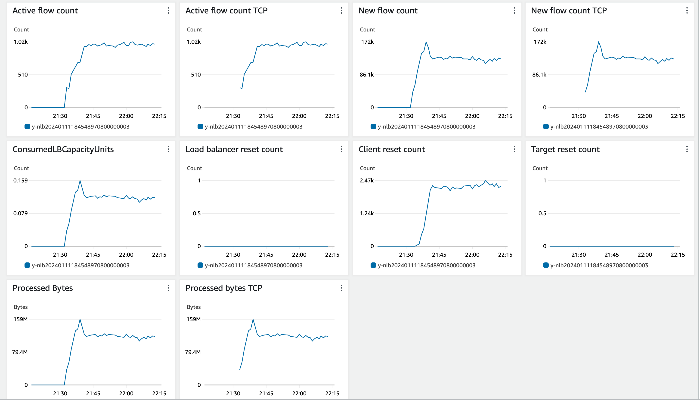
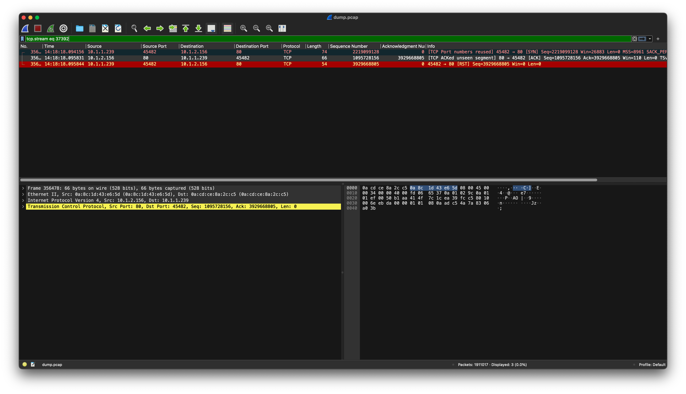
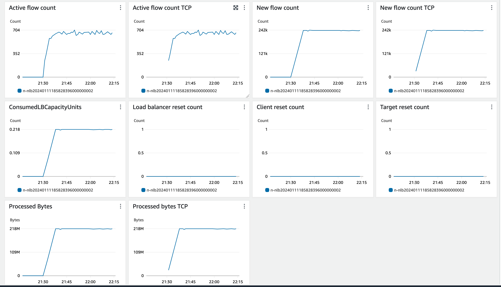

This attempts to demonstrate an issue one might encounter when traffic is sent to an ALB, through a VPC endpoint/NLB in AWS. When a VPC endpoint is introduced, clients might discover that TCP connections occasionally fail to open.

This spins up two test cases; one sending traffic to an ALB via a VPC endpoint/NLB, and the other sending traffic to the ALB through an NLB directly (no VPCe). Each case sendings 1000 requests per second from 4 EC2 instances (4000 rps total).



### Results

Traffic sent through VPCe is extremely degraded. The "Client reset count" metric is elevated as a result of clients receiving a challenge ACK back, and sending a RST (as defined in https://datatracker.ietf.org/doc/html/rfc5961#section-4).

As a result, clients fail to open connections, and throughput/performance is degraded.

**With VPCe**





**Without VPCe**



### Usage

This can be spun up with a simple terraform apply:

```
terraform apply
```

It'll spin up 8 total instances sending traffic for 30 minutes.
